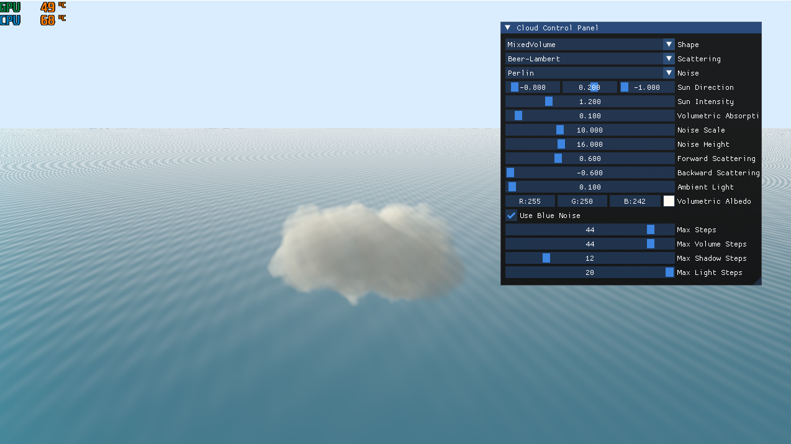
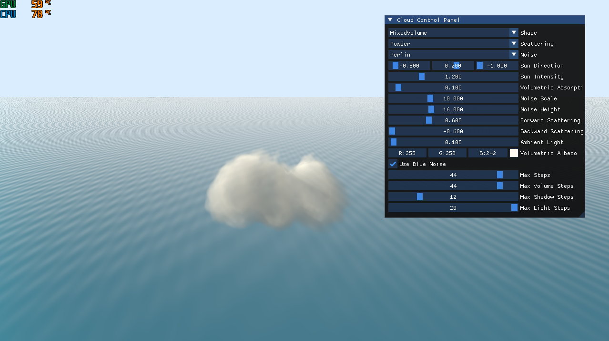
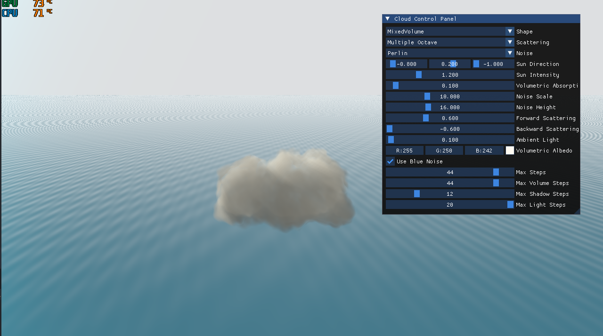
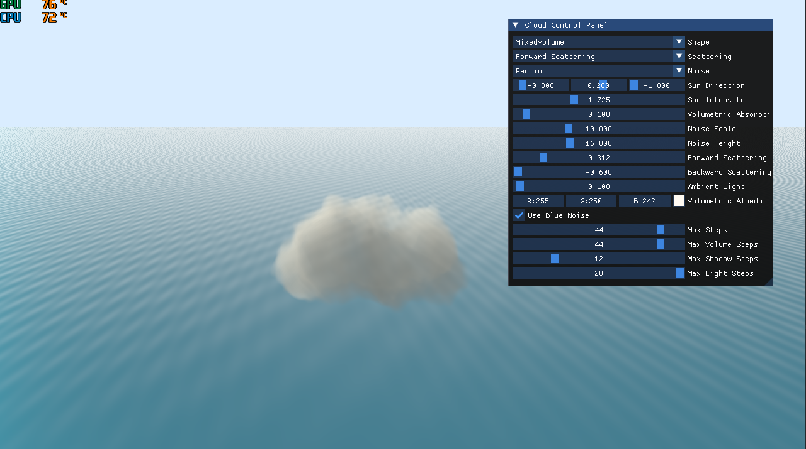
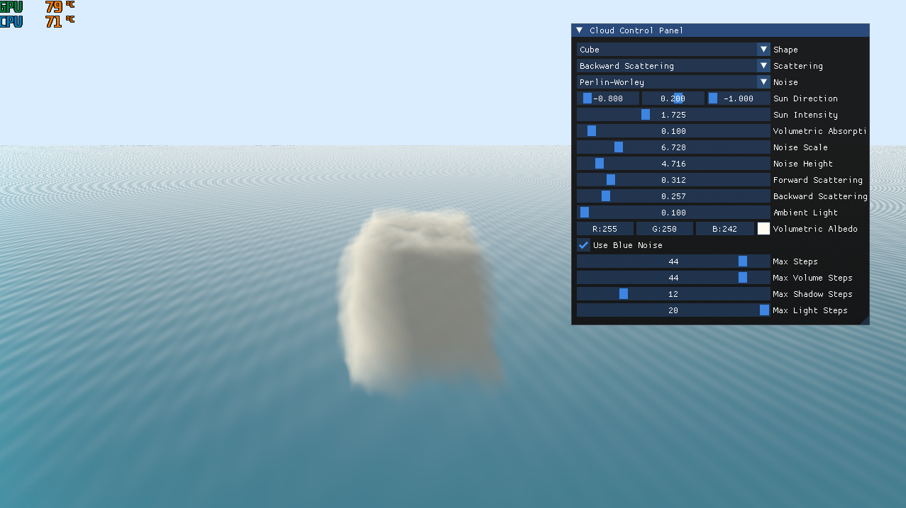
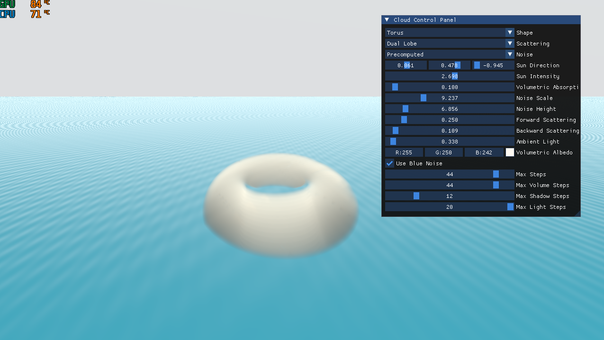

Some recent results of my cloud scene!

Beer Lambert

Beer Lambert with Powder effect : https://www.guerrilla-games.com/read/the-real-time-volumetric-cloudscapes-of-horizon-zero-dawn

Multiple Octave Scattering : https://www.researchgate.net/publication/262309690_Oz_the_great_and_volumetric 

Forward Scattering

Backward Scattering

Dual Lobe Scattering

