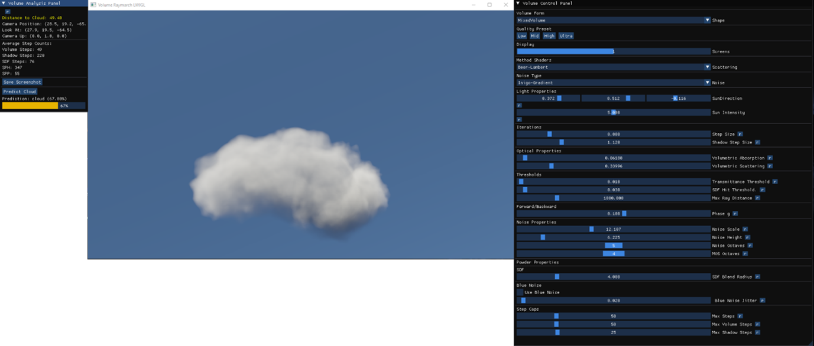
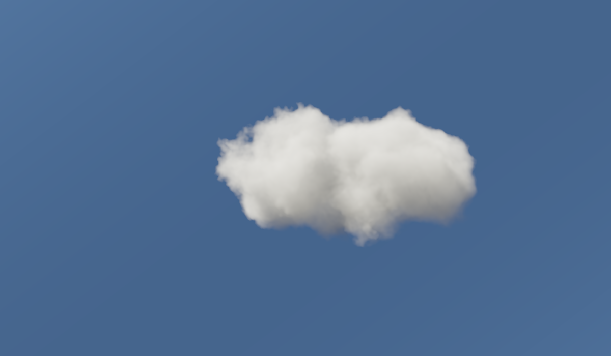
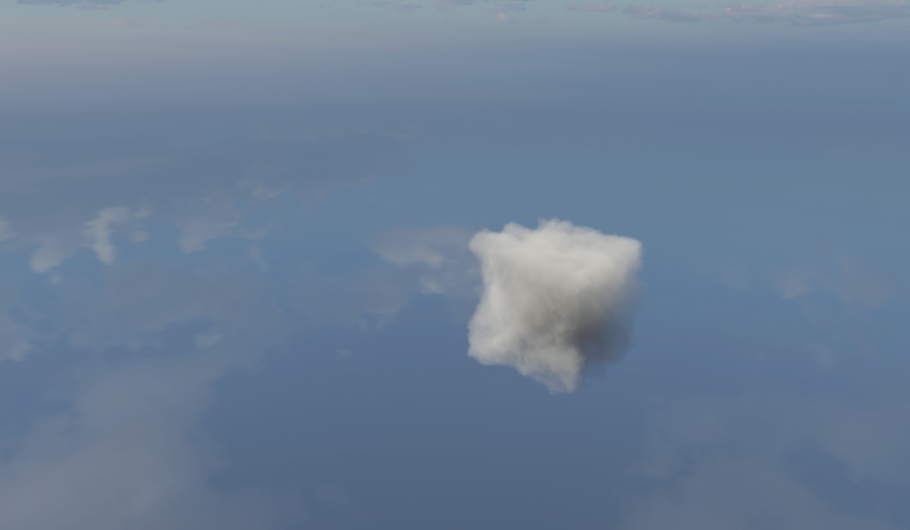
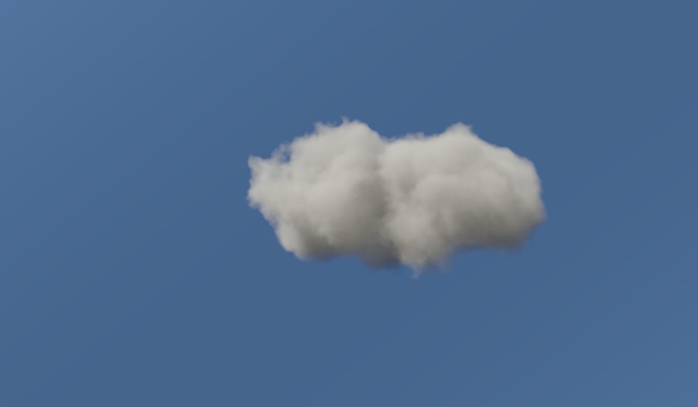
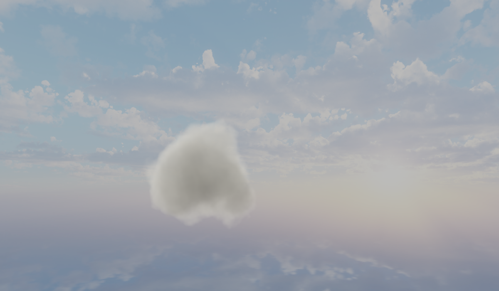
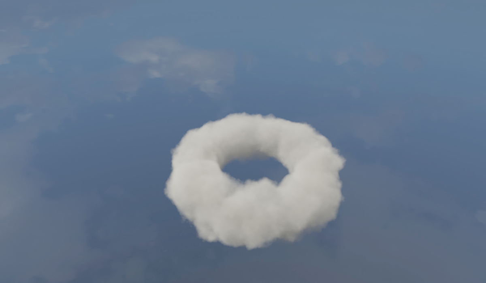
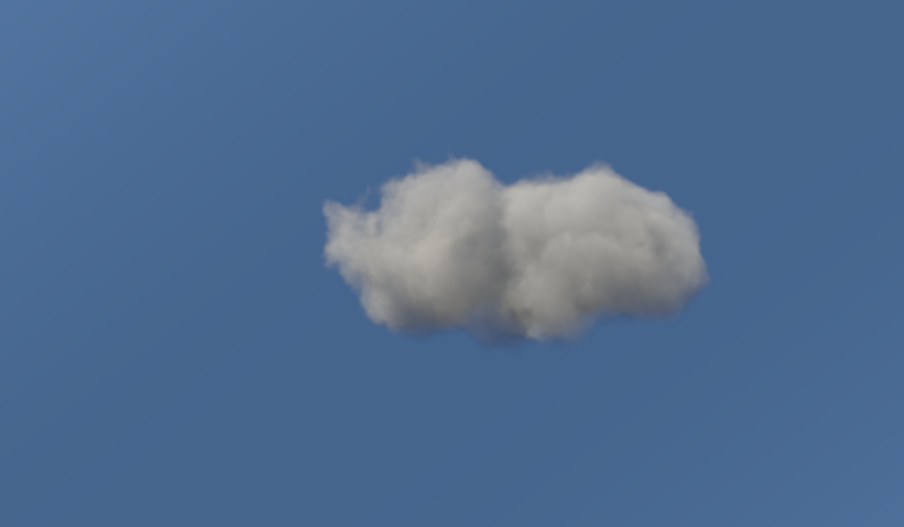
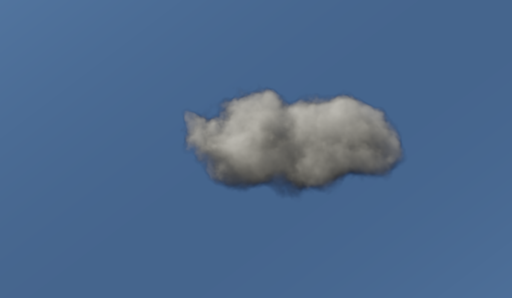

# VoluMarch: Vergleich von Absorption- und Streuungsverfahren in volumetrischen Raymarching-Szenen

## Projektübersicht

Dieses Projekt ist Teil einer Bachelorarbeit an der HTW Berlin und kombiniert volumetrische Raymarching-Techniken mit einem Deep-Learning-basierten Klassifikationssystem für gerenderte Volumenbilder. Es wurde als Echtzeit-Renderer für volumetrische Effekte wie Wolken oder Rauch entwickelt.

Ein integriertes Analyse-Tool ermöglicht Performance-Benchmarking über vier Qualitätsstufen (LOW, MID, HIGH, ULTRA). Dabei werden Messdaten wie GPU-Zeiten, Schrittanzahl und Trefferraten systematisch aufgezeichnet und ausgewertet. Ergänzend bewertet ein trainiertes neuronales Netz die visuelle Glaubwürdigkeit der Renderings, indem es diese in „Wolke“ oder „keine Wolke“ klassifiziert.

## Hauptfunktionen

* **Raymarching-Engine in Java (LWJGL 4.4)**

    * Multiple Streumodelle: Beer-Lambert, Single Scattering mit Heyney-Greenstein Phase Funktion, Multiple Octave Scattering (MOS), Powder
    * Unterstützung für verschiedene Rauschtypen: Inigo-Gradient, 3D Texture(Perlin und Simplex)
    * Unterstützung für Umgebungsbeleuchtung (Himmel oder Cubemap)
    * Echtzeit-GUI basierend auf ImGui zur interaktiven Steuerung von Rendering-Parametern
    * Resources : Chris's Graphics Blog : https://wallisc.github.io/rendering/2020/05/02/Volumetric-Rendering-Part-2.html, Real-time dreamy Cloudscapes with Volumetric Raymarching:https://blog.maximeheckel.com/posts/real-time-cloudscapes-with-volumetric-raymarching/, Procedural Volumetric Clouds: https://www.wedesoft.de/software/2023/05/03/volumetric-clouds/ 
  
* **Cloud-Classifier in Python (TensorFlow)**

    * Binäre Klassifikation (Wolke / Keine Wolke) mit MobileNetV2, basierend auf dem Projekt https://github.com/Slayingripper/Cloud-Classification
    * Der Klassifikator wurde übernommen und an die spezifischen Anforderungen dieser Arbeit angepasst (u. a. Datenstruktur, Schwellenwerte, Integration in den Renderprozess)
    * Beobachtung und Bewertung von gerenderten Bildern in Echtzeit (Watchdog + Modellinferenz)
    * Automatische Plot-Erstellung und Ergebniszusammenfassung

## Struktur

### Java-Teil (Rendering)

Pfad: `src/org.java.render`

* `VolumeRaymarchLWJGL.java`: Einstiegspunkt und Hauptlogik für Raymarching
* `RenderSettings.java`: Parametrisierung der Szenen
* `RendererSSBO.java`: Shader-Management & Framebuffer-Ausgabe
* `GuiController.java`: UI zur Steuerung von Kamera, Licht, Material, Noise, etc.

Shader befinden sich in `src/res.shaders`, strukturiert nach:

* `main`: zentrale Shader-Pipeline
* `models`: verschiedene Streumodelle (GLSL)
* `noise`: unterschiedliche Noise-Funktionen

### Python-Teil (Cloud-Klassifikation)

Pfad: `Cloud-Classification`

* `cloud_trainer.py`: Training des Klassifikationsmodells
* `comp.py`: Watchdog-Inferenzprozess zur Bewertung von gerenderten Bildern
* `ccsn_cloudNotCloud_classification_model.keras`: Das finale Modell

##  Batch-Rendering & Analyse

Die Datei `BatchBenchmark.java` erlaubt automatisierte Testserien:

```bash
java -jar VoluMarch.jar [<quality>] <noise> <resolution> <model1> [model2] [...]
# Beispiel:
java -jar VoluMarch.jar MID noise_perlin 1600x900 beer_lambert powder MOS
```
**Unterstützte Argumente im Benchmark-Modus:**

* `--width=<px>` und `--height=<px>`: Auflösung setzen (alternativ: `1600x900` als drittes Argument)
* Vordefinierte Qualitätsstufen: `LOW`, `MID`, `HIGH`, `ULTRA` (optional als erstes Argument)
* `noise`: z. B. `gradient_noise`, `noise_precomputed`, etc.
* `modelX`: Modellnamen ohne Erweiterung, z. B. `beer_lambert`, `MOS`


Ergebnisse werden in `results/fullruns` und `results/average` abgelegt. Python-Skripte in `scripts/` erzeugen daraus Visualisierungen.

##  Debug-Modus

Der Debug-Modus kann beim Start über das Flag `--debug` aktiviert werden, Es können gleichzeitig mehrere Argumente übergeben werden:

```bash
java -jar VoluMarch.jar MID --debug --width=2560 --height=1440
```
Unterstützte Argumente im Debug-Modus:

    --width=<px> und --height=<px>: Auflösung setzen

    Vordefinierte Qualitätsstufen LOW,MID,HIGH,ULTRA etc.

    --no-debug: Schaltet den Debug-Modus explizit aus

Im Debug-Modus stehen erweiterte Funktionen zur Verfügung:

* Interaktive Benutzeroberfläche (ImGui) zur Steuerung von Rendering-Parametern
* Echtzeit-Kamerasteuerung (WASD + Mauslook)
* Analysepanel mit Metriken wie Raymarching-Schritten, Sample-Raten und Entfernung zur Wolke
* Manuelle Klassifikation durch das ML-Modell via "Predict Cloud"-Button
* Screenshot-Export mit automatischer Dateibenennung

Zur Deaktivierung:

```bash
java -jar VoluMarch.jar --no-debug
```

##  Cloud-Klassifikation: Funktionsweise

Nach dem Rendern speichert der Renderer Screenshots unter `results/predictions/`. Das Python-Skript `comp.py` beobachtet diesen Ordner und wendet das geladene Keras-Modell an, um festzustellen, ob das Bild Wolken enthält oder nicht. Die Ausgabe erfolgt über die Konsole und wird zurück an den Java-Renderer geleitet (falls Debug-Modus aktiviert).

## Plotten & Analyse

Skripte wie `auto_plot_data.py` aggregieren Durchschnittswerte (GPU-Zeit, Samples per Pixel/Hit, Trefferquote etc.) und erzeugen Plots mit Matplotlib und Plotly. Ausgabe: `results/plots/`

## Abhängigkeiten

### Java:

* LWJGL 4.4+
* ImGui for Java (GLFW + OpenGL Backend)

### Python:

* TensorFlow 2.x
* watchdog, Pillow, NumPy, scikit-learn, matplotlib, plotly

## Sonstiges

* Shader-Skripte befinden sich in `res/shaders`
* Noise-Texturen (z.B. 3D Blue Noise) unter `assets/3DTextures/`
* Modelle werden als GLSL-Dateien geladen (z.B. `beer_lambert.glsl`, `henyey_greenstein.glsl`,`MOS.glsl`, `powder.glsl`)

## Preview

Beispielhafte gerenderte Volumenszenen:

### Rendering



### Beer Lambert Mixed Volume


### Beer Lambert Cube


### Henyey-Greenstein Mixed Volume


### Henyey-Greenstein Sphere


### Henyey-Greenstein  Torus


### MOS Mixed Volume


### Powder Mixed Volume



 

